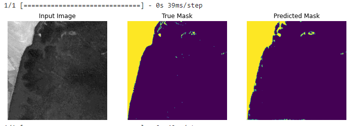

# Detecting deforestation using deep learning

This projet entails the application of deep learning algorithms i.e. CNN to detect deforestation using satellite imagery.

## Data
I analysed Sentinel-2 images (cloud free) of three different regions in the State of Mato Grosso in Brazil and derived a total of 5,122 image chips and masks of size ***256 * 256***. See a sample of training images and masks in the sample data folder.

## Data Augmentation
Image chips were flipped left and right before fed into the network for training. See preprocess.py

## Model
Unet model was implemented by using MobileNetV2 as the feature extraction with pre-trained weights.

More on Unet model [U-Net: Convolutional Networks for Biomedical Image Segmentation](https://lmb.informatik.uni-freiburg.de/people/ronneber/u-net/)

## Training
The model was trained first using the pre-trained weights of the base model for 15 epochs with early stopping. The best result was achieved by re-training the whole model for 20 epochs and attained a binary accuracy of 0.9780.

## Requirements

        - tensorflow
        - keras
        - numpy
        - matplotlib
        - pandas
        - cv2
        
## Results

